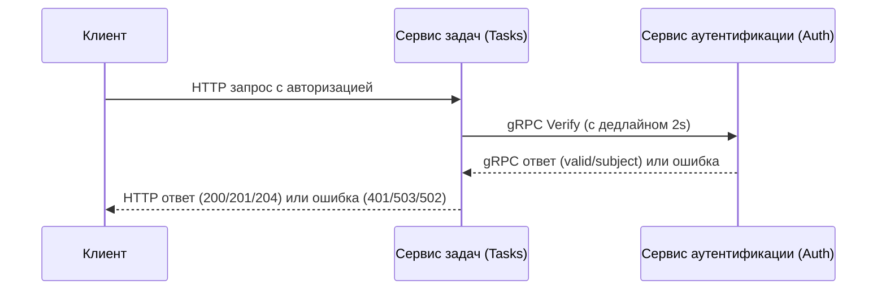

# Диаграмма последовательности для PZ18

```mermaid
sequenceDiagram
    participant C as Клиент
    participant T as Сервис задач (Tasks)
    participant A as Сервис аутентификации (Auth)

    C->>T: HTTP запрос с авторизацией
    T->>A: gRPC Verify (с дедлайном 2s)
    A-->>T: gRPC ответ (valid/subject) или ошибка
    T-->>C: HTTP ответ (200/201/204) или ошибка (401/503/502)
```